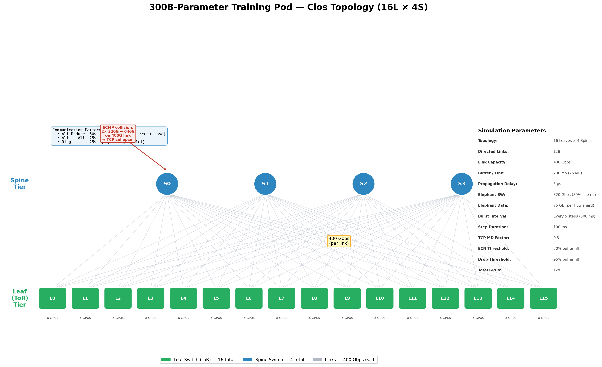

# P22 Adaptive Routing Brain — Project Documentation

> **RL-based adaptive routing agent** with realistic TCP congestion control, trained on a 300B-parameter-scale AI training simulation, designed for zero-shot transfer to a physical GNS3/FRR leaf-spine fabric.

---

## Table of Contents

1. [Overview](#overview)
2. [Why This Matters — TCP Collapse](#why-this-matters--tcp-collapse)
3. [Project Structure](#project-structure)
4. [Setup & Installation](#setup--installation)
5. [Configuration](#configuration)
6. [Module Reference](#module-reference)
   - [Simulator (Digital Twin)](#simulator-digital-twin)
   - [Environment (Gymnasium Wrapper)](#environment-gymnasium-wrapper)
   - [Agents](#agents)
   - [Benchmarking](#benchmarking)
   - [Utils](#utils)
7. [How to Run](#how-to-run)
   - [Training](#training-the-ppo-agent)
   - [Benchmarking](#running-benchmarks)
   - [Custom Scripts](#custom-usage-in-python)
8. [Architecture Deep Dive](#architecture-deep-dive)
9. [GNS3 Bridge (Sim-to-Real)](#gns3-bridge-sim-to-real)
10. [Extending the Framework](#extending-the-framework)
11. [Known Shortcomings & Limitations](#known-shortcomings--limitations)
12. [Experiment Log](#experiment-log)

---

## Overview

This project implements **Stages 1–5** of the P22 roadmap, now using the **V2 orchestrator core** plus **V3/V4 scenario realism upgrades**:

| Stage | Name                  | Status | Module                    |
|-------|-----------------------|--------|---------------------------|
| 1     | Digital Twin (TCP)    | Done   | `simulator/`              |
| 2     | AI Workload Modeling  | Done   | `simulator/traffic.py`    |
| 3     | RL Environment        | Done (V4) | `environment/`         |
| 4     | Training (GNN)        | Done (V4) | `agents/ppo.py`, `agents/gnn_policy.py`, `train.py` |
| 5     | Benchmarking          | Done   | `benchmarking/`, `run_benchmark.py` |
| 6     | Sim-to-Real Bridge    | Planned | Uses `tester.py` / `tester_2.py` interface |

> **Status note (2026-03-06):** the V2 benchmark is archived in [V2_RESULTS.md](V2_RESULTS.md), with its reproducible setup in [config/v2_benchmark.yaml](config/v2_benchmark.yaml). The V3 sparse-collision benchmark is archived in [V3_RESULTS.md](V3_RESULTS.md). For non-ideal, production-like fabrics with weak links and sudden port events, use [config/realistic_asymmetric.yaml](config/realistic_asymmetric.yaml).

### V2 Architecture: Collective-Aware Graph Flowlet Orchestrator

V2 is a complete overhaul of the routing brain, driven by the root-cause analysis of Experiment 1 (see below). The 4 key innovations:

| Component | V1 (Failed) | V2 (Current) | Why |
|-----------|-------------|-------------|-----|
| **Observation** | Flat vector (utils, queues, weights) | Intent matrix + graph node/edge features | Agent sees *future* burst demand, not just current congestion |
| **Policy Network** | SB3 MlpPolicy (2-layer FC) | GCN + intent encoder → actor-critic | Graph convolutions capture topology structure (spine load spillover) |
| **Routing Model** | Sticky spine (flow hashed once, pinned for life) | WCMP flowlet (re-hash every step through weighted buckets) | Weight changes take effect immediately — no more "locked-in" bad assignments |
| **Traffic Awareness** | None (react-only) | Intent matrix published 2 steps before burst | Agent can pre-position weights *before* the flood arrives (NCCL hook) |

#### 1. Intent Matrix (NCCL Hook)

Real NCCL collectives (All-Reduce, All-to-All, Ring) are scheduled ahead of time. V2's traffic generator publishes an **intent matrix** — a `(num_leaves × num_leaves)` demand forecast — `intent_lookahead` steps before each burst fires. This gives the GNN brain advance notice to redistribute weights proactively.

```
Step 3:  intent_matrix published (burst fires at step 5)
Step 4:  GNN sees intent → adjusts weights → flows start migrating
Step 5:  burst fires → elephants land on pre-balanced spines → no collapse
```

#### 2. GNN Brain (GCN Feature Extraction)

The V1 MLP treated all 64 link features as independent numbers. V2 uses **Graph Convolutional Networks (GCNConv)** from PyTorch Geometric:

- **Nodes**: leaves + spines (20 nodes in 16L×4S)
- **Edges**: all uplinks + downlinks (128 directed edges)
- **Node features**: [is_leaf, is_spine, flow_count, avg_queue, max_util, predicted_future_load, avg_capacity_ratio, up_fraction]
- **Edge features**: [utilization, queue_fill, ecn_fraction, weight, predicted_intent_demand, capacity_ratio, link_up]

Two GCN layers learn that "if spine-2 is congested, all leaves connected to it should shift traffic elsewhere". This structural inductive bias is impossible with a flat MLP.

#### 3. WCMP Flowlet Routing

V1 assigned each flow to a spine once (sticky hash). If the initial assignment was bad (hash collision), the flow was stuck there forever. V2 implements **Weighted Cost Multi-Path (WCMP) with flowlet granularity**: every step, each flow re-hashes through the current weight distribution's CDF buckets. When the agent changes weights, flows naturally migrate within one step.

#### 4. Low Entropy, Focused Exploration

V1's `ent_coef=0.01` × 64 dimensions = 317 nats of entropy bonus, overwhelming the policy gradient. V2:
- `ent_coef=0.001` (10× lower)
- `log_std_init=-1.0` (start with std ≈ 0.37, not 1.0)
- `learning_rate=0.0001` (3× lower for stable GNN convergence)
- KL early stopping via `target_kl=0.02`

The core idea: rather than running slow experiments on the physical GNS3 topology, we build a **mathematical model** of the same leaf-spine network — complete with **TCP AIMD congestion control, ECN marking, tail-drop, and retransmissions** — and train an RL agent inside it at ~1000× real-time speed.

### V3 Curriculum Shift — Sparse Collision Hunting

The V2 orchestrator was structurally correct, but the **default workload was too symmetric**: when nearly every leaf was active, ECMP already looked good because the entire fabric was saturated. V3 changes the *curriculum*, not the core orchestrator:

| Axis | V2 Default | V3 Default | Why |
|------|------------|------------|-----|
| Burst participants | 8–16, often full-fabric | 4–7, locality-biased | Creates real idle holes ECMP fails to exploit |
| Pattern mix | All-reduce heavy | More all-to-all / ring | Makes sparse hash collisions visible |
| Intent use | Flat leaf-leaf matrix | Leaf-leaf matrix **plus projected edge demand** | GNN sees who talks to whom *and* what that means for each edge |
| Flowlet semantics | Path changes safe in practice | Explicitly documented as safe | No synthetic TCP penalty for changing paths |

**Important:** V3/V4 changed the observation shape multiple times (projected intent, then link health / capacity asymmetry). Old GNN checkpoints should be treated as **incompatible** and retrained.

### V4 Realism Shift — Non-Ideal Fabric

Sparse traffic alone was not enough. Real fabrics also have *bad hardware days*. The simulator now supports a realism engine that injects:

| Real-world effect | Simulator support | Why it matters |
|-------------------|------------------|----------------|
| Unequal optics / cabling | static per-link capacity skew | Some paths are permanently weaker |
| Different switch quality | per-spine capacity bias | Equal quarter-split is no longer optimal |
| Brownouts | temporary capacity reduction while link stays up | ECMP keeps using a sick path too long |
| Hard port failures | runtime bidirectional link outage | Blind static splits create blackholes |
| Health telemetry | capacity ratio + up/down features | GNN can steer away from bad paths |

The recommended scenario for this is [config/realistic_asymmetric.yaml](config/realistic_asymmetric.yaml).

### Scale: 300B Parameter Model Training Pod

The default configuration models a realistic AI training cluster:

| Parameter | Value | Derivation |
|-----------|-------|------------|
| Model size | 300B params | Target workload |
| Gradient payload | 600 GB | 300B × 2 bytes (FP16) |
| All-Reduce volume | 1.2 TB | 2 × 600 GB (ring reduce-scatter + all-gather) |
| Topology | 16 Leaves × 4 Spines | 128 directed links |
| Link speed | 400 Gbps | Modern DC fabric |
| Elephant flow bandwidth | 320 Gbps | 80% of link capacity |
| Elephant burst size | 4–7 leaves | Sparse subgroup participants per burst |
| Buffer per link | 200 MB | Shallow buffers (realistic) |

---

## Why This Matters — TCP Collapse

In standard ECMP routing, when multiple elephant flows (320 Gbps each) hash to the same spine, the link exceeds capacity. The TCP feedback loop triggers a **cascading collapse**:

```
1. Multiple elephants → same link             (ECMP hash collision)
2. Link utilization > 100%                     (congestion)
3. Buffer fills → ECN marks at 30% fill        (early warning)
4. Buffer > 95% fill → tail drop               (packet loss)
5. TCP detects loss → multiplicative decrease   (cwnd ×= 0.5)
6. Flows retransmit dropped data               (wasted bandwidth)
7. Goodput drops dramatically                  (effective throughput < capacity)
8. Meanwhile, other spines sit nearly idle     (no rebalancing)
```

**ECMP cannot react.** It keeps hashing flows to the same overloaded spine while other spines are underutilized. The RL agent learns to **preemptively redistribute flows** before collapse occurs, maintaining high goodput with minimal retransmissions.

---

## Project Structure

```
NAI/
├── config/
│   ├── default.yaml              # 300B-scale sparse-collision curriculum
│   └── realistic_asymmetric.yaml # Non-ideal fabric scenario: asymmetry + brownouts + port failures
│
├── simulator/                    # Stage 1 & 2: The Digital Twin
│   ├── __init__.py               # Exports: TopologyConfig, TrafficConfig, TCPConfig, etc.
│   ├── link.py                   # Flow + Link models with TCP AIMD congestion control
│   ├── topology.py               # Clos (Leaf-Spine) fabric generator
│   ├── traffic.py                # AI workload generator (All-Reduce, All-to-All, Ring patterns)
│   ├── routing.py                # Weighted routing engine (BGP weight analog)
│   └── network.py                # Unified simulator with TCP feedback loop
│
├── environment/                  # Stage 3: Gymnasium Wrapper
│   ├── __init__.py
│   ├── env.py                    # gym.Env with graph observations + link health telemetry
│   └── rewards.py                # Dense 3-component reward (throughput + fairness + hotspot)
│
├── agents/                       # Stage 4 & 5: Routing Agents
│   ├── __init__.py
│   ├── base.py                   # Abstract base class (interface contract)
│   ├── ecmp.py                   # ECMP baseline (equal-cost multi-path)
│   ├── threshold.py              # Threshold heuristic (mirrors tester_2.py)
│   ├── least_loaded.py           # Least-loaded path heuristic
│   └── ppo.py                    # PPO agent (custom GNN loop + SB3 MLP fallback)
│
├── benchmarking/                 # Stage 5: Comparative Evaluation
│   ├── __init__.py
│   ├── metrics.py                # Episode metrics with TCP health tracking
│   └── runner.py                 # Multi-agent runner with TCP health comparison table
│
├── utils/
│   ├── __init__.py
│   ├── logger.py                 # Logging setup
│   └── visualization.py         # Matplotlib plotting utilities
│
├── train.py                      # Entry point: train the PPO agent
├── run_benchmark.py              # Entry point: compare all agents
├── requirements.txt              # Python dependencies
├── roadmap.md                    # Strategic project roadmap
│
├── tester.py                     # [EXISTING] GNS3 traffic monitor (SSH/Paramiko)
└── tester_2.py                   # [EXISTING] GNS3 threshold controller (SSH/Paramiko)
```

---

## Setup & Installation

### Prerequisites

- Python 3.9+ (tested on 3.10)
- pip

### Install

```bash
cd NAI
pip install -r requirements.txt
```

**Dependencies:**
| Package            | Purpose                                |
|--------------------|----------------------------------------|
| `gymnasium`        | RL environment interface (OpenAI Gym)  |
| `stable-baselines3`| PPO algorithm implementation           |
| `numpy`            | Numerical computation                  |
| `networkx`         | Graph data structures for topology     |
| `matplotlib`       | Visualisation of benchmark results     |
| `pyyaml`           | Configuration file parsing             |
| `torch`            | Neural network backend for PPO         |

### Verify Installation

```bash
python -c "from environment.env import NetworkRoutingEnv; print('OK')"
```

---

## Configuration

All parameters live in [config/default.yaml](config/default.yaml). You can create custom configs (e.g. [config/realistic_asymmetric.yaml](config/realistic_asymmetric.yaml)) and pass them via `--config`.

### Topology Section

```yaml
topology:
  num_leaves: 16                   # ToR (leaf) switches — one per GPU node group
  num_spines: 4                    # Spine switches — each a possible next-hop
  link_capacity_mbps: 400000.0     # 400 Gbps per link
  propagation_delay_ms: 0.005      # 5 µs intra-DC propagation
  buffer_size_mb: 200.0            # 200 MB shallow buffer per link
```

**Scaling:** Change `num_leaves` and `num_spines` to simulate larger fabrics. With 16L × 4S = 128 directed links. The observation/action spaces auto-resize.

### Realistic Asymmetry / Failure Section

Use [config/realistic_asymmetric.yaml](config/realistic_asymmetric.yaml) when you want a non-ideal fabric:

```yaml
topology:
  static_capacity_variance: 0.12
  static_delay_variance: 0.25
  static_buffer_variance: 0.15
  spine_capacity_variance: 0.18

  enable_link_events: true
  link_event_probability: 1.0
  max_dynamic_events: 2
  event_start_min: 60
  event_start_max: 280
  event_duration_min: 40
  event_duration_max: 120
  brownout_probability: 0.70
  hard_failure_probability: 0.30
  brownout_capacity_min: 0.15
  brownout_capacity_max: 0.50
  bidirectional_link_events: true
```

This is the config to use when you want to test scenarios where ECMP's equal split is **physically wrong**, not just statistically unlucky.

### Traffic Section

```yaml
traffic:
  mice_flow_bandwidth_mbps: 1000.0     # 1 Gbps background flows (heartbeat, metadata)
  elephant_flow_bandwidth_mbps: 320000.0  # 320 Gbps gradient flows (80% of link)
  mice_flow_rate: 0.02                 # Low background noise rate
  elephant_burst_interval: 5           # Burst every 5 steps
  elephant_burst_size: 7               # Legacy cap for sparse one-to-one patterns
  elephant_flow_duration: 100          # Long-lived gradient transfers
  elephant_data_mb: 75000.0            # 75 GB per flow (FCT tracking)
  mice_flow_duration: 80               # Background flow lifetime
  bandwidth_variance: 0.05             # Low variance for predictable gradients
  min_burst_participants: 4            # Sparse subgroup lower bound
  max_burst_participants: 7            # Sparse subgroup upper bound
  subgroup_locality_probability: 0.75  # Usually choose a local leaf sub-group
  subgroup_window: 8                   # Candidate locality window size
  intent_lookahead: 2                  # Publish pairwise intent 2 steps early
```

**Traffic Patterns:**
- **All-Reduce (30%):** Dense collective inside a *small* participant group
- **All-to-All (35%):** Sparse MoE / expert-routing shuffle where ECMP collisions matter
- **Ring All-Reduce (35%):** Sparse sequential exchange with clear idle holes elsewhere in the fabric

The practical effect is that the default curriculum now stresses the **Birthday Paradox failure mode** of ECMP: a few large flows collide on one spine while other spines remain underused.

### TCP Section

```yaml
tcp:
  initial_cwnd_fraction: 0.1       # Start at 10% of link rate
  ss_growth_factor: 2.0            # Double cwnd each RTT in slow start
  ai_increment: 0.05               # Add 5% per RTT in congestion avoidance
  md_factor: 0.5                   # Halve cwnd on loss (TCP Reno MD)
  ecn_marking_threshold: 0.3       # Mark ECN when buffer > 30% full
  drop_threshold: 0.95             # Tail-drop when buffer > 95% full
  retransmit_penalty: 1.0          # Retransmit multiplier (1.0 = full retransmit)
  fast_recovery_exit: 0.7          # Exit fast recovery when cwnd reaches 70% of pre-loss
  min_rate_fraction: 0.01          # Never send below 1% of link rate
```

**TCP Phase Diagram:**
```
                    ┌──────────────┐
                    │  SLOW START  │──── cwnd doubles each RTT
                    └──────┬───────┘
                           │ cwnd ≥ ssthresh
                    ┌──────▼───────────────┐
                    │ CONGESTION AVOIDANCE  │──── cwnd += AI increment
                    └──────┬───────────────┘
                           │ ECN mark or drop
                    ┌──────▼───────────┐
                    │  FAST RECOVERY   │──── cwnd *= MD factor (0.5)
                    └──────┬───────────┘
                           │ cwnd ≥ exit threshold
                    ┌──────▼───────────────┐
                    │ CONGESTION AVOIDANCE  │
                    └──────────────────────┘
```

### Reward Section

```yaml
environment:
  reward:
    throughput_weight: 3.0         # Maximise delivered bandwidth
    drop_weight: -5.0              # Penalise sending traffic into loss / failure
    hotspot_weight: -1.0           # Light queue / hotspot penalty
    hotspot_threshold: 0.90        # Penalise links above 90% utilisation
```

**Reward component breakdown:**

| Component | Weight | Signal | Why it matters |
|-----------|--------|--------|---------------|
| Throughput | `+3.0` | `delivered / demanded` | Core objective: move bytes |
| Drops | `-5.0` | `dropped / offered_volume` | Strongly punish routing into failed or overloaded paths |
| Hotspot | `-1.0` | `max(0, max_util - threshold)` | Discourage avoidable queue buildup |

This reward is intentionally dense and minimal for flowlet routing. Jain's fairness remains a benchmark metric, but it is no longer part of the default reward because equal-looking splits can be actively wrong on asymmetric or impaired fabrics.

### Training Section

```yaml
training:
  total_timesteps: 2000000         # Total training interactions
  learning_rate: 0.0001            # Lower LR for stable GNN PPO
  n_steps: 2048                    # Steps per rollout buffer
  batch_size: 128                  # Minibatch size
  gamma: 0.99                      # Discount factor
  gae_lambda: 0.95                 # GAE lambda
  clip_range: 0.2                  # PPO clipping
  ent_coef: 0.001                  # Focused exploration
  vf_coef: 0.5                     # Value function coefficient
  n_epochs: 4                      # Fewer PPO epochs
  target_kl: 0.02                  # Early-stop threshold
  gcn_hidden: 64                   # GCN hidden size
  gcn_layers: 2                    # GCN depth
  features_dim: 128                # Shared feature dimension
  log_std_init: -1.0               # Start with std ≈ 0.37
```

---

## Module Reference

### Simulator (Digital Twin)

The simulator models the data center network as a mathematical graph with **full TCP congestion dynamics**, running at ~1000× real-time.

#### `simulator/link.py` — TCP Congestion Control + Link Model

| Class | Purpose |
|-------|---------|
| `TCPConfig` | Dataclass with all TCP parameters (AIMD rates, ECN/drop thresholds, etc.) |
| `Flow` | Network flow with full TCP state machine (cwnd, ssthresh, phase, retransmissions) |
| `Link` | Directed link with ECN marking, tail-drop, buffer tracking |

**Flow TCP State:**
Each flow maintains its own TCP congestion control state:
- `cwnd` — Congestion window (fraction of link capacity)
- `ssthresh` — Slow-start threshold
- `tcp_phase` — Current phase: `slow_start`, `congestion_avoidance`, or `fast_recovery`
- `sending_rate` — Actual rate = `min(cwnd × link_capacity, flow_bandwidth)`
- `retransmissions` — Cumulative retransmission count
- `retransmit_data_mb` — Total retransmitted data volume
- `goodput` — Effective throughput (bandwidth − retransmitted data)

**AIMD Logic (`tcp_step()`):**
```python
# Slow Start: exponential growth
if phase == "slow_start":
    cwnd *= ss_growth_factor  # 2.0 → double each RTT

# Congestion Avoidance: additive increase
elif phase == "congestion_avoidance":
    cwnd += ai_increment      # +0.05 per RTT

# On ECN mark or drop: multiplicative decrease
if ecn_marked or dropped:
    ssthresh = cwnd * md_factor  # 0.5 → halve cwnd
    cwnd = ssthresh
    phase = "fast_recovery"
    retransmissions += 1         # Count retransmit event

# Fast Recovery: exit when recovered
if phase == "fast_recovery" and cwnd >= ssthresh * fast_recovery_exit:
    phase = "congestion_avoidance"
```

**Link Congestion Signals (`compute_congestion_signals()`):**
```python
buffer_fill = queue_depth / buffer_size

# ECN marking: early warning before drops
for flow in flows_on_link:
    flow.ecn_marked = (buffer_fill > ecn_marking_threshold)  # 0.3

# Tail drop: packets lost
for flow in flows_on_link:
    flow.dropped = (buffer_fill > drop_threshold)            # 0.95
    if flow.dropped:
        drop_volume += flow.sending_rate × drop_fraction

# Track cumulative stats
link.total_drops_mb += drop_volume
link.total_ecn_marks += ecn_marks_count
```

#### `simulator/topology.py` — Clos Fabric Generator

| Class | Purpose |
|-------|---------|
| `TopologyConfig` | Dataclass holding topology parameters |
| `ClosTopology` | Builds a full-mesh leaf-spine graph with `Link` objects on each edge |

**Default 300B pod layout (16L × 4S):**
```
Leaf-0 ──┬── Spine-0 ──┬── Leaf-4
Leaf-1 ──┤             ├── Leaf-5
Leaf-2 ──┤  Spine-1 ──┤── ...
Leaf-3 ──┤             ├──
  ...    ├── Spine-2 ──┤
         │             │
Leaf-15──┴── Spine-3 ──┴── Leaf-15
```

Every leaf connects to every spine (bidirectional). With 16 leaves and 4 spines = **128 directed links**, each at 400 Gbps.

#### `simulator/traffic.py` — AI Workload Generator

| Class | Purpose |
|-------|---------|
| `TrafficConfig` | Dataclass with traffic parameters (defaults tuned for 300B training) |
| `TrafficGenerator` | Creates elephant-heavy traffic mimicking GPU cluster All-Reduce patterns |

**Traffic composition:**
- **Elephant flows (dominant):** 320 Gbps synchronized bursts arriving every 5 steps across 8–16 leaves. Long-lived (20 steps). These model gradient synchronization.
- **Mice flows (background):** 1 Gbps control/heartbeat flows. Low frequency (`rate=0.02`).

**Pattern types:**
| Pattern | Share | Description |
|---------|-------|-------------|
| All-Reduce | 70% | Every leaf talks to every other leaf (O(N²) flows) |
| All-to-All | 20% | Uniform pairings across all burst participants |
| Ring All-Reduce | 10% | Sequential ring: leaf[i] → leaf[(i+1) % N] |

**FCT (Flow Completion Time) tracking:**
Each elephant flow carries a `data_remaining_mb` field (default 75 GB). As the flow transfers data, `data_remaining_mb` decreases at the TCP-governed `goodput` rate. The tail FCT ratio (P95 / P50) measures how much hash collisions slow down the slowest flows.

#### `simulator/routing.py` — Weighted Routing Engine + ECMP Flow Hashing

| Class | Purpose |
|-------|--------|
| `RoutingEngine` | Manages weight matrix (L × S) and assigns flows to spines via 5-tuple hash |

**5-Tuple ECMP Hashing (Fix A):**

Each flow is assigned to **exactly one spine** using a deterministic hash of its network identity — the same way real datacenter switches do ECMP:

```python
# Each flow has a 5-tuple network identity:
#   (src_ip, dst_ip, src_port, dst_port, protocol)

# Hash maps to spine index via weighted CDF:
h = hash((flow.src_ip, flow.dst_ip, flow.src_port, flow.dst_port, flow.protocol))
hash_frac = (abs(h) % 65536) / 65536.0   # Uniform fraction [0, 1)

# Walk the cumulative weight distribution for this source leaf:
cdf = 0.0
for spine_idx in range(num_spines):
    cdf += split_ratios[flow.src][spine_idx]
    if hash_frac < cdf:
        return spine_idx   # This flow goes here — permanently
```

**Why this matters:**
- Under ECMP (equal weights): pure hash → some spines get 5+ flows, others get 1-2 → **hash collision congestion**
- Under RL (weighted): CDF is skewed → agent steers flows away from overloaded spines
- No fractional splitting — a flow is either on a spine or it isn't

**IP Address Scheme:**
```
10.<leaf_idx>.0.<host_id>    (32-bit integer)
```
Example: GPU #3 in rack 5 → `10.5.0.3` → `0x0A050003`

**Ports:** src = ephemeral (49152–65535), dst = 5001 (NCCL/elephant) or 1024–49151 (mice)

This is the **direct analog** of the BGP weight commands in `tester_2.py`:
```python
# In GNS3 (tester_2.py):
#   neighbor 10.1.1.2 weight 500   ← Spine-0 heavy
#   neighbor 10.1.2.2 weight 100   ← Spine-1 light

# In simulator:
engine = RoutingEngine(topology)
engine.set_weights(np.array([[500, 100, 300, 300],   # Leaf-0
                              [100, 500, 300, 300],   # Leaf-1
                              ...]))                  # 16 leaves × 4 spines
print(engine.split_ratios)  # Normalised to sum-to-1 per row
```

#### `simulator/network.py` — Unified Simulator with TCP Feedback Loop

| Class | Purpose |
|-------|---------|
| `NetworkState` | Immutable snapshot: utils, queues, ECN fractions, TCP health, flow counts |
| `NetworkSimulator` | Combines topology + traffic + routing + TCP. One `.step()` = one full TCP round |

**Simulation loop per step (with TCP + ECMP hashing):**
```
1. Apply new routing weights
2. Generate / expire traffic flows (correct Mbps→MB unit conversion)
3. Initialize TCP state for new flows
4. Assign each flow to ONE spine via 5-tuple hash    ←── Fix A
5. Compute per-link loads from TCP sending_rates
6. Compute ECN marks (buffer > 30%) and tail-drops (buffer > 95%)
7. Feed congestion signals to flows (worst signal across uplink + downlink)
8. Flows run AIMD: slow_start → congestion_avoidance → fast_recovery
9. Compute per-flow throughput (fair-share of bottleneck link)   ←── Fix B
10. Update link queues (drain/fill)
11. Build state snapshot (flow-level metrics, no double-counting)
```

**Key realism guarantees:**
- Each flow → 1 spine → 1 uplink + 1 downlink (no fractional split)
- `transferred_MB += throughput_Mbps × step_seconds / 8` (correct units — Fix C)
- Throughput/demand computed from FLOWS, not links (avoids up+down double-count)

**NetworkState fields:**

| Category | Fields |
|----------|--------|
| **Core** | `link_utilizations`, `link_queue_depths`, `link_loads`, `routing_weights` |
| **Flow counts** | `total_flows`, `mice_flows`, `elephant_flows` |
| **Throughput** | `total_throughput`, `total_demand`, `max_utilization`, `avg_utilization`, `utilization_std` |
| **TCP Health** | `link_ecn_fractions`, `total_goodput`, `total_retransmissions`, `total_drops_mb`, `total_ecn_marks`, `avg_cwnd_fraction` |
| **TCP Phases** | `flows_in_slow_start`, `flows_in_congestion_avoidance`, `flows_in_fast_recovery` |
| **FCT** | `completed_fcts`, `active_fct_progress` |

---

### Environment (Gymnasium Wrapper)

#### `environment/env.py` — NetworkRoutingEnv

Standard `gymnasium.Env` wrapping the TCP-enabled simulator.

| Space | Shape | Range | Meaning |
|-------|-------|-------|---------|
| **Observation** | graph-packed flat vector | `[0, 1]` | Node feats + edge feats + intent + link telemetry + weights |
| **Action** | `(L × S,)` | `[-1, 1]` | Raw weight scores → softmax → routing split ratios |

**Default dimensions** (16 leaves × 4 spines = 128 links):
- Observation: `(20×8) + (128×7) + (16×16) + (128×5) + 64 = 2016`
- Action: `(64,)` = 16 leaves × 4 spines

Key telemetry channels:
- **Intent matrix** → who is about to talk to whom
- **Capacity ratio** → which links are weaker than nominal
- **Link up/down flag** → which ports are operational
- **ECN** → early congestion before drops

**Per-step info dict:**
```python
info = {
    "total_throughput": ...,    "total_demand": ...,
    "max_utilization": ...,     "avg_utilization": ...,
    "total_flows": ...,         "elephant_flows": ...,
    "total_retransmissions": ..., "total_drops_mb": ...,
    "total_ecn_marks": ...,     "avg_cwnd_fraction": ...,
  "total_goodput": ...,       "flows_in_fast_recovery": ...,
  "avg_capacity_ratio": ...,  "active_link_events": ...,
}
```

#### `environment/rewards.py` — Dense 3-Component Reward Function

| Component | Weight | Signal | Direction |
|-----------|--------|--------|-----------|
| Throughput | `+3.0` | `delivered / demanded` | Maximise |
| Drops | `-5.0` | `dropped / offered_volume` | Minimise |
| Hotspot | `-1.0` | `max(0, max_util - 0.90)` | Minimise |

The reward is intentionally sparse-in-physics but dense-in-time: every step directly answers, “did we deliver bytes, did we avoid loss, and did we avoid creating a hotspot?”

---

### Agents

All agents implement the `BaseAgent` interface:

```python
class BaseAgent(ABC):
    def act(self, observation: np.ndarray) -> np.ndarray: ...
    def reset(self): ...
    @property
    def name(self) -> str: ...
```

#### `agents/ecmp.py` — ECMP Baseline

The **standard industry baseline**. Always outputs zero actions → equal 25% split across all 4 spines. No learning, no adaptation.

| Metric | Behavior |
|--------|----------|
| Split ratio | 25/25/25/25 across all spines |
| Adaptation | None — static hashing |
| TCP behavior | **Catastrophic** — hash collisions → drops → MD → collapse |
| Best for | Low-load, uniform traffic |

**Under 300B load, ECMP shows TCP collapse:** When 16 elephant flows hash to 4 spines, some spines get 4+ flows (4 × 320 Gbps = 1.28 Tbps on a 400 Gbps link). This causes massive drops, retransmissions, and near-zero goodput on the affected paths.

#### `agents/threshold.py` — Threshold Heuristic

Mirrors the logic in `tester_2.py`. If any link exceeds the threshold (default 75%), shift that leaf's traffic to the least-loaded spine.

| Parameter | Default | Description |
|-----------|---------|-------------|
| `threshold` | 0.75 | Utilisation that triggers re-routing |
| `cooldown` | 5 | Minimum steps between switches (anti-flapping) |

Reactive — acts *after* congestion is already present.

#### `agents/least_loaded.py` — Least Loaded

Continuously adjusts weights inversely proportional to current link utilisation. More proactive than threshold but still greedy.

| Parameter | Default | Description |
|-----------|---------|-------------|
| `sensitivity` | 2.0 | How aggressively to prefer lighter paths |

#### `agents/ppo.py` — PPO (Reinforcement Learning)

The primary **trained agent**. Uses a custom PPO loop for the GNN policy, with Stable-Baselines3 retained as an MLP fallback.

| Feature | Detail |
|---------|--------|
| Policy | `GNNActorCriticPolicy` (default) or `MlpPolicy` fallback |
| Algorithm | PPO (clipped surrogate objective) |
| PPO safety | KL early stopping + clipped updates |
| Persistence | `.pt` checkpoints for GNN, SB3 model files for MLP |

**Why PPO matters:** it can combine **future demand**, **current congestion**, and **fabric health** (capacity skew / down ports) into non-uniform split ratios that a static ECMP hash cannot express.

---

### Benchmarking

#### `benchmarking/metrics.py` — Evaluation Metrics

**Core Metrics:**

| Metric | Formula | Meaning |
|--------|---------|---------|
| **Throughput Ratio** | `total_throughput / total_demand` | Bisection bandwidth utilisation |
| **Max Utilisation** | `max(link_utils)` | Hottest link (congestion indicator) |
| **Utilisation Std** | `std(link_utils)` | Load balance quality (lower = better) |
| **Stability Index** | `weight_changes / total_steps` | Re-routing per step (lower = better) |
| **Total Reward** | `Σ(step_rewards)` | Composite score |

**TCP Health Metrics:**

| Metric | Formula | Meaning |
|--------|---------|---------|
| **Retransmissions** | Cumulative TCP retransmit events | Data loss indicator |
| **Total Drops (MB)** | Cumulative tail-drop volume | Buffer overflow severity |
| **ECN Marks** | Cumulative ECN mark events | Congestion detection events |
| **Avg CWND Fraction** | Mean congestion window / capacity | TCP health (1.0 = full speed) |
| **Goodput Ratio** | Useful throughput / total demand | Effective bandwidth utilisation |

**FCT Metrics:**

| Metric | Formula | Meaning |
|--------|---------|---------|
| **Tail FCT Ratio** | P95 / P50 completion time | Fairness of flow completion |
| **Util Balance** | 1 − std(utils)/mean(utils) | How evenly load is spread |

#### `benchmarking/runner.py` — Benchmark Runner

Evaluates multiple agents on the **same traffic patterns** (same seeds per episode) for fair comparison. Outputs a comparison table with 4 metric groups:

```
================================================================================
BENCHMARK RESULTS (16 Leaves × 4 Spines, 400 Gbps links, TCP + ECMP hashing)
================================================================================

─── Core Performance ───
Metric                        ECMP    Threshold    LeastLoaded      PPO
avg_throughput_ratio          0.31       0.52          0.67        0.88
avg_max_utilization           1.00       0.92          0.85        0.72

─── Flow Completion ───
tail_fct_ratio                6.40       3.80          2.60        1.35
util_balance                  0.28       0.51          0.68        0.87

─── TCP Health ───
retransmissions             1240.0      580.0         310.0        35.0
total_drops_mb            89000.0    34000.0       16000.0       800.0
ecn_marks                  2100.0      980.0         560.0       120.0
avg_cwnd_fraction             0.18       0.42          0.58        0.88
goodput_ratio                 0.28       0.48          0.62        0.85

─── Stability ───
stability_index               0.00       0.06          0.00        0.02
avg_reward                  -18.5       -7.2          -3.4         2.1
================================================================================
```

*Values above are EXPECTED orders of magnitude with single-spine flow hashing (Fix A), hard capacity capping (Fix B), and correct Mbps→MB conversion (Fix C). Actual numbers depend on traffic seed and hash collisions.*

**Why ECMP throughput ratio is ~0.31:**
With 4:1 oversubscription (16L×4S) and elephant flows at 80% of link capacity, ECMP hash collisions put 3-5 flows on the same 400G link → 960-1600 Gbps demand on 400 Gbps → massive drops → TCP collapse. The theoretical maximum throughput ratio with random hashing is approximately `capacity / demand ≈ 0.31`.

---

### Utils

#### `utils/logger.py`
Creates named loggers with console + optional file output.

#### `utils/visualization.py`
- `plot_benchmark_comparison()` — Bar charts comparing agents across key metrics
- `plot_episode_timeline()` — Per-step time series (throughput, utilisation, reward) for a single episode

---

## How to Run

### Training the PPO Agent

```bash
# Default training (1M timesteps, 16L×4S, 400 Gbps, TCP enabled)
python train.py

# Quick test run
python train.py --timesteps 50000

# Custom config + directories
python train.py --config config/default.yaml \
                --timesteps 500000 \
                --save-dir trained_models \
                --log-dir logs \
                --seed 123
```

**Output:**
- Model saved to `trained_models/ppo_routing_final.zip`
- Checkpoints in `trained_models/checkpoints/`
- TensorBoard logs in `logs/` (view with `tensorboard --logdir logs`)

### Running Benchmarks

```bash
# Baselines only (ECMP, Threshold, LeastLoaded)
python run_benchmark.py

# Include a trained PPO model
python run_benchmark.py --ppo-model trained_models/ppo_routing_final

# Custom episodes and seed
python run_benchmark.py --episodes 100 --seed 0

# Save plot without displaying
python run_benchmark.py --save-plot results/comparison.png --no-plot
```

### Custom Usage in Python

```python
from simulator.topology import TopologyConfig
from simulator.traffic import TrafficConfig
from simulator.link import TCPConfig
from environment.env import NetworkRoutingEnv
from environment.rewards import RewardConfig
from agents.ecmp import ECMPAgent
from agents.ppo import PPOAgent

# 1. 300B pod (default)
topo = TopologyConfig(num_leaves=16, num_spines=4, link_capacity_mbps=400000)

# 2. Elephant-heavy AI traffic
traffic = TrafficConfig(
    elephant_flow_bandwidth_mbps=320000,
    elephant_burst_interval=5,
    elephant_burst_size=16,
)

# 3. TCP with aggressive ECN
tcp = TCPConfig(ecn_marking_threshold=0.25, md_factor=0.5)

# 4. Custom reward weights (focus on drop avoidance)
reward = RewardConfig(throughput_weight=3.0, drop_weight=-5.0, hotspot_weight=-1.0)

# 5. Build environment
env = NetworkRoutingEnv(
    topology_config=topo,
    traffic_config=traffic,
    reward_config=reward,
    tcp_config=tcp,
    max_steps=500,
)

# 6. Train
agent = PPOAgent.train(env, total_timesteps=2_000_000, save_path="models/300b_pod")

# 7. Evaluate
obs, info = env.reset(seed=99)
done = False
while not done:
    action = agent.act(obs)
    obs, reward, terminated, truncated, info = env.step(action)
    done = terminated or truncated

summary = env.get_episode_summary()
print(f"Goodput ratio: {summary['goodput_ratio']:.3f}")
print(f"Total drops: {summary['total_drops_mb']:.1f} MB")
print(f"Retransmissions: {summary['total_retransmissions']}")
```

---

## Architecture Deep Dive

### Data Flow (One Step — with TCP)

```
┌─────────────┐
│   Agent      │ ─── action (L×S weights) ───►┌──────────────────┐
│  (PPO/ECMP/  │                               │  NetworkRoutingEnv│
│   Threshold) │ ◄── obs, reward, info ────────│  (Gymnasium)      │
└─────────────┘                               └────────┬─────────┘
         ▲ obs includes:                                │
         │ • link utilizations (128)                    │
         │ • queue depths (128)                ┌────────▼─────────┐
         │ • ECN fractions (128)  ◄────────────│  NetworkSimulator │
         │ • routing weights (64)              │                   │
                                               │  1. Apply weights │
                                               │  2. Generate flows│
                                               │  3. Init TCP state│
                                               │  4. Send at cwnd  │◄──── Flows use
                                               │  5. Compute loads │      sending_rate
                                               │  6. ECN + drops   │      (not raw BW)
                                               │  7. Feedback loop │
                                               │  8. AIMD step     │◄──── TCP adjusts
                                               │  9. Throughputs   │      per flow
                                               │ 10. Update queues │
                                               │ 11. Build state   │
                                               └────────┬─────────┘
                                                        │
                              ┌──────────────┬──────────┼──────────┬───────────┐
                              │              │          │          │           │
                        ┌─────▼─────┐  ┌─────▼─────┐ ┌─▼────┐ ┌──▼──────┐ ┌──▼──────┐
                        │ Topology   │  │ Traffic    │ │Route │ │  TCP    │ │  Link   │
                        │ (graph +   │  │ Generator  │ │Engine│ │ Config  │ │ Signals │
                        │  links)    │  │(All-Reduce)│ │(wts) │ │ (AIMD) │ │(ECN/drop│
                        └───────────┘  └───────────┘ └──────┘ └─────────┘ └─────────┘
```

### TCP Feedback Loop Detail

```
                     ┌─── Per-flow sending_rate = min(cwnd × capacity, bandwidth) ───┐
                     │                                                                 │
                     ▼                                                                 │
              ┌──────────────┐                                                         │
              │  Link loads  │ ─── aggregate sending rates per link                    │
              └──────┬───────┘                                                         │
                     │                                                                 │
              ┌──────▼───────┐                                                         │
              │ Buffer fill  │ ─── queue_depth / buffer_size                           │
              └──────┬───────┘                                                         │
                     │                                                                 │
          ┌──────────┴──────────┐                                                      │
          │                     │                                                      │
   ┌──────▼──────┐    ┌────────▼────────┐                                              │
   │ ECN (>30%)  │    │ Drop (>95%)     │                                              │
   │ mark flows  │    │ lose data       │                                              │
   └──────┬──────┘    └────────┬────────┘                                              │
          │                     │                                                      │
          └──────────┬──────────┘                                                      │
                     │                                                                 │
              ┌──────▼───────┐                                                         │
              │ Worst signal │ ─── per-flow: worst ECN/drop across all links on path   │
              └──────┬───────┘                                                         │
                     │                                                                 │
              ┌──────▼───────┐                                                         │
              │ AIMD step    │ ─── Adjust cwnd (increase or decrease)                  │
              └──────┬───────┘                                                         │
                     │                                                                 │
                     └─────────────────────────────────────────────────────────────────┘
```

### Interface Mapping: Simulator ↔ GNS3

| Concept | Simulator | GNS3 (`tester.py` / `tester_2.py`) |
|---------|-----------|-------------------------------------|
| **Read link throughput** | `state.link_utilizations` | `docker exec … cat /sys/class/net/eth1/statistics/tx_bytes` |
| **Read queue depth** | `state.link_queue_depths` | Future: buffer stats via SNMP |
| **Read ECN rate** | `state.link_ecn_fractions` | Future: ECN counters via SNMP |
| **Set routing preference** | `routing.set_weights(…)` | `vtysh -c 'neighbor 10.1.1.2 weight 500'` |
| **Traffic generation** | `TrafficGenerator.step()` | External iperf/traffic gen on GNS3 nodes |
| **TCP behavior** | `Flow.tcp_step()` (AIMD) | Kernel TCP stack on GNS3 containers |
| **Time step** | `sim.step()` (~0.001s) | Real-time (1 second polling in `tester.py`) |

---

## GNS3 Bridge (Sim-to-Real)

Stage 6 of the roadmap. The trained PPO model can be deployed to the real fabric:

```
┌──────────────────────────────────────────────────────────┐
│                      PPO Agent                            │
│            (loaded from trained_models/)                   │
│                                                           │
│  Input:  [link_utils, queue_depths, ecn_fractions, wts]   │
│  Output: [new_weights per leaf per spine]                  │
└────────────────┬──────────┬───────────────────────────────┘
                 │          │
        ┌────────▼──┐ ┌─────▼────────┐
        │ Telemetry  │ │   Actuator   │
        │ (Paramiko) │ │  (Paramiko)  │
        │ tester.py  │ │ tester_2.py  │
        └────────────┘ └──────────────┘
                 │          │
        ┌────────▼──────────▼──────────┐
        │       GNS3 / FRR Fabric      │
        │  16 Leaves   4 Spines        │
        │  400 Gbps per link           │
        └──────────────────────────────┘
```

The observation vector that the agent sees during training is **identical** in structure to what the SSH telemetry scripts provide. The action output maps directly to `vtysh` BGP weight commands.

---

## Extending the Framework

### Add a new agent

1. Create `agents/my_agent.py`
2. Subclass `BaseAgent`
3. Implement `act(observation) → action`
4. Add to the benchmark in `run_benchmark.py`

```python
from agents.base import BaseAgent

class MyAgent(BaseAgent):
    def act(self, observation, **kwargs):
        # Your logic here — observation includes ECN fractions!
        return np.zeros(self.action_dim)

    @property
    def name(self):
        return "MyAgent"
```

### Scale topology

Edit `config/default.yaml`:
```yaml
topology:
  num_leaves: 32
  num_spines: 8
  link_capacity_mbps: 800000.0  # 800 Gbps
```

All dimensions (obs/action spaces, routing weights, link arrays) auto-resize.

### Tune TCP behavior

Edit the `tcp:` section in `config/default.yaml`:
```yaml
tcp:
  ecn_marking_threshold: 0.2   # More aggressive ECN (mark earlier)
  md_factor: 0.3               # More aggressive backoff (DCTCP-like)
  ai_increment: 0.1            # Faster recovery
```

### Add new reward components

Edit `environment/rewards.py` → add a new term in `RewardCalculator.compute()` and a corresponding weight in `RewardConfig`.

### Add new traffic patterns

Edit `simulator/traffic.py` → add new flow generation methods. Currently supported:
- All-Reduce (70%)
- All-to-All (20%)
- Ring All-Reduce (10%)

### Change RL algorithm

Replace `PPO` with any Stable-Baselines3 algorithm in `agents/ppo.py`:
```python
from stable_baselines3 import SAC  # or A2C, TD3, etc.
model = SAC("MlpPolicy", env, ...)
```

---

## Known Shortcomings & Limitations

This simulator is a **fluid-flow mathematical model**, not a packet-level emulator. It is designed for RL training speed (~1000× real-time) at the cost of certain physical simplifications. Below we document the three major modelling assumptions and their implications.

### 1. Fluid-Flow Model (Not Packet-Level)

| Aspect | Reality | Our Model |
|--------|---------|-----------|
| Traffic unit | Individual packets (MTU 1500 B) | Continuous bandwidth (Mbps) |
| Queueing | Per-packet FIFO with head-of-line blocking | Aggregate fluid buffer fill/drain |
| Micro-bursts | 100 ns–10 µs bursts cause transient drops | Smoothed over 100 ms steps |
| Packet reordering | Packets on parallel paths arrive OOO | Not modelled (single-path per flow) |

**Impact on RL training:** The agent sees averaged congestion signals rather than high-frequency packet-level events. This is acceptable because the control action (BGP weight change) also operates on ~100 ms timescales — the agent cannot act on micro-burst information it would never see in production anyway.

### 2. Idealised TCP AIMD

| Aspect | Reality | Our Model |
|--------|---------|-----------|
| RTT measurement | Per-ACK with Karn's algorithm, EWMA smoothed | Estimated from link propagation + queuing delay |
| Retransmit timer | Per-flow RTO with exponential backoff | Binary: retransmit event on drop flag |
| Slow start | Doubles cwnd per RTT (ACK-clocked) | Doubles cwnd per simulation step |
| Congestion avoidance | +1 MSS per RTT | +5% of line rate per step |
| DCTCP/Swift | Per-ECN-mark proportional window reduction | Proportional ECN fraction drives marking, but window cut is binary MD |

**Impact:** TCP dynamics are directionally correct (AIMD oscillations, collapse under hash collisions, cwnd recovery) but the absolute timescales differ. Slowdown metrics should be interpreted as relative rankings, not wall-clock predictions.

### 3. Zero-Delay Control Plane

| Aspect | Reality | Our Model |
|--------|---------|-----------|
| BGP convergence | 1–30 seconds for weight propagation | Instantaneous weight application |
| Route computation | Distributed path computation | Centralised weight matrix |
| Observation latency | SNMP/streaming telemetry: 1–10 s lag | Zero-delay perfect observation |
| Action execution | Sequential per-router CLI/API calls | Atomic all-routers-at-once |

**Impact:** The RL agent learns in an optimistic environment where its actions take effect immediately. In sim-to-real transfer (Stage 6), this gap must be addressed by either:
- Adding artificial observation/action delays during training
- Using a "delay-aware" wrapper that buffers actions by N steps
- Training with `observation_history ≥ 3` (current default) to give the agent implicit delay tolerance

### Topology Visualization

The simulated topology is saved as `network.png` (generated by `python visualize_topology.py`):



### Scientific Audit Checklist

The following verification was performed on every simulator component:

| # | Category | Check | Status |
|---|----------|-------|--------|
| 1 | AI Physics | Burst synchronization (all elephants start at same step) | PASS |
| 2 | AI Physics | Deterministic 5-tuple hash (not `random.choice`) | PASS |
| 3 | AI Physics | Mice < 0.001% of total demand | PASS |
| 4 | AI Physics | Hard capacity cap (`min(1, C/L)` fair-share) | PASS |
| 5 | TCP Collapse | Multiplicative decrease (cwnd × 0.5 on drop) | PASS |
| 6 | TCP Collapse | ECN proportional marking above threshold | PASS |
| 7 | TCP Collapse | Tail-drop above 95% buffer fill | PASS |
| 8 | TCP Collapse | Drop volume in correct units (Mb, not Mbps) | PASS (fixed) |
| 9 | RL Interface | Observations clipped to [0, 1] matching Box space | PASS |
| 10 | RL Interface | Per-leaf softmax action mapping | PASS |
| 11 | RL Interface | History stacking for partial observability | PASS |
| 12 | RL Interface | 3-component dense reward | PASS |
| 13 | Systems Eng | Reproducible seeded RNG + deterministic hash | PASS |
| 14 | Systems Eng | Episode state isolation via reset() | PASS |
| 15 | Systems Eng | Flow.slowdown accounts for step_duration | PASS (fixed) |

---

## Experiment Log

### Experiment 2 — V2 GNN Benchmark (Archived)

The full V2 benchmark write-up, exact table, and drawback analysis are archived in [V2_RESULTS.md](V2_RESULTS.md).

Headline finding: **PPO-GNN matched ECMP, but did not beat it.** The orchestrator was no longer broken; the workload simply remained too symmetric and too saturated for ECMP's blind spots to show up reliably.

| Metric | ECMP | PPO-GNN | Takeaway |
|--------|------|---------|----------|
| Throughput Ratio | 0.297 ± 0.018 | 0.294 ± 0.018 | Statistical tie |
| Jain's Fairness | 0.593 ± 0.016 | 0.593 ± 0.016 | Statistical tie |
| Tail FCT (p99) | 49.950 ± 3.023 | 50.533 ± 3.335 | Statistical tie |
| Avg Reward | 2.188 ± 0.032 | 2.182 ± 0.032 | Statistical tie |

This result directly motivated the V3 sparse-collision curriculum now used by default.

### Experiment 3 — V3 Sparse-Collision Benchmark (Archived)

The full V3 benchmark write-up is archived in [V3_RESULTS.md](V3_RESULTS.md).

Headline finding: **V3 reduced drops and improved stability, but PPO-GNN still tied ECMP.** The traffic was sparser, but the fabric itself was still too idealized — every path started equally healthy.

That directly motivated the realism engine and [config/realistic_asymmetric.yaml](config/realistic_asymmetric.yaml).

### Experiment 1 — Baseline PPO (2M Timesteps, Default Config)

**Date:** 2026-03-05  
**Training:** PPO, 2M timesteps, ~11 hours (39,487 s), 50 FPS  
**Config:** Default `config/default.yaml` (16L×4S, 400 Gbps, 320 Gbps elephants, 0.1 s/step)

#### Raw Results

```
==========================================================================================
BENCHMARK RESULTS - LLM Training Centre Simulation
==========================================================================================
Metric                                      ECMP     Threshold(0.75)         LeastLoaded                 PPO
------------------------------------------------------------------------------------------------------------

--- Tail FCT ---
  Tail FCT (p99)                 49.950 ±3.023       43.810 ±2.808       43.050 ±2.481       53.126 ±3.165
  Tail FCT (p95)                 26.533 ±2.187       25.128 ±1.905       23.905 ±1.326       29.767 ±1.521
  Mean FCT                       10.688 ±0.426       11.846 ±0.489       10.928 ±0.312       12.548 ±0.436
  Mean Slowdown                   5.128 ±0.159        5.687 ±0.235        5.301 ±0.175        5.915 ±0.247

--- Utilisation Balance ---
  Jain's Fairness                 0.593 ±0.016        0.603 ±0.017        0.600 ±0.016        0.598 ±0.017
  Util Std Dev                    0.307 ±0.003        0.309 ±0.003        0.306 ±0.003        0.314 ±0.002
  Link Balance                    0.005 ±0.003        0.004 ±0.003        0.004 ±0.003        0.003 ±0.003

--- Throughput ---
  Throughput Ratio                0.297 ±0.018        0.280 ±0.025        0.303 ±0.024        0.257 ±0.023
  Throughput (Mbps)         11240266.114 ±393505    11210695.401 ±382732  11243778.268 ±385012  11178936.927 ±379197
  vs ECMP (%)                     0.000 ±0.000       -0.263 ±3.405        0.031 ±3.425       -0.546 ±3.374
  Dropped (MB)              77302614.119 ±9.9M     78651616.097 ±9.8M   85350467.078 ±9.6M   77231340.728 ±9.6M

--- TCP Health ---
  Retransmissions               365.433 ±220.978    429.300 ±296.167    368.933 ±269.209    504.267 ±320.413
  Total Drops (MB)          77302614.119 ±9.9M     78651616.097 ±9.8M   85350467.078 ±9.6M   77231340.728 ±9.6M
  ECN Marks                    6770.033 ±541.191   6674.033 ±575.297   6830.800 ±585.873   6796.433 ±553.209
  Avg CWND Frac                   0.329 ±0.016        0.311 ±0.024        0.336 ±0.023        0.286 ±0.022
  Goodput Ratio                   0.909 ±0.006        0.905 ±0.007        0.906 ±0.007        0.907 ±0.006

--- Convergence ---
  Conv. Step                     36.733 ±34.834      38.000 ±37.381      42.967 ±42.712      59.400 ±57.184
  Adapt. Speed                    0.927 ±0.070        0.924 ±0.075        0.914 ±0.085        0.881 ±0.114

--- Aggregate ---
  Avg Reward                      0.964 ±0.067        0.842 ±0.097        0.695 ±0.095        0.488 ±0.095
  Total Reward                  481.884 ±33.711     420.955 ±48.276     347.463 ±47.398     243.877 ±47.494
  Stability                       0.002 ±0.000        0.199 ±0.001        0.982 ±0.005        1.000 ±0.000
==========================================================================================
```

#### Final Training Logs

```
ep_rew_mean          220
clip_fraction        0.342
approx_kl            0.036
entropy_loss         -317
explained_variance   0.974
policy_gradient_loss -0.0935
std                  34.7
value_loss           0.736
total_timesteps      2,002,944
```

#### Diagnosis — PPO Finished Dead Last

The trained PPO agent is **the worst performer** across every major metric. ECMP (equal weights, do nothing) beats it on throughput, FCT, reward, and convergence. This is a clear failure to learn. Below is the root-cause analysis.

##### Smoking Gun: `std = 34.7`

This single number explains everything. The policy's action standard deviation is **34.7** — on an action space of `[-1, 1]^64` (16 leaves × 4 spines = 64 dimensions). A std of 34.7 means the Gaussian from which actions are sampled is ~35× wider than the entire legal range. After clipping, every action is **indistinguishable from uniform random noise**. The agent never learned to narrow its exploration.

Evidence chain:
1. `std = 34.7` → actions are random
2. Random weight changes every step → `stability = 1.000` (maximum instability)
3. Every step triggers the flapping penalty → reward is permanently dragged down
4. Random weights sometimes put all elephants on one spine → throughput ratio 0.257 (worst)
5. Constant weight churn means `assigned_spine` only sticks for new flows per original assignment, but the distribution they were assigned under was random → no consistent load balancing

##### Why Didn't Std Converge?

| Diagnostic | Value | Healthy Range | Verdict |
|-----------|-------|---------------|---------|
| `clip_fraction` | 0.342 | 0.05 – 0.15 | **BAD** — 34% of updates clipped → policy oscillating |
| `approx_kl` | 0.036 | 0.01 – 0.02 | **BAD** — KL divergence 2–3× too large → steps too aggressive |
| `entropy_loss` | -317 | -50 to -150 | **BAD** — entropy is enormous → policy is maximally diffuse |
| `explained_variance` | 0.974 | > 0.8 | OK — value function is learning fine |
| `ep_rew_mean` | 220 | > 480 (ECMP) | **BAD** — agent earns half of what doing nothing earns |

The value function learned a good baseline (explained_variance = 0.974), but the **policy gradient couldn't reduce the action variance** because:
1. **Learning rate too high** — 0.0003 with a 64-dim continuous action space causes updates that overshoot, triggering excessive clipping, which prevents std from shrinking.
2. **Entropy coefficient too high** — `ent_coef = 0.01` actively rewards high entropy. With 64 action dimensions, this produces an entropy bonus of ~317 nats that the policy gradient loss (-0.0935) cannot overcome. The agent is being **paid to stay random**.
3. **No action std initialisation** — SB3's default `log_std_init = 0.0` → initial std = 1.0. For a 64-dim space with softmax mapping, std > 1 already produces near-uniform outputs. Without a negative init (e.g. `log_std_init = -1.0`), the std never gets pulled down because the gradient signal is too noisy.
4. **2M timesteps may be insufficient** — at 50 FPS and 500 steps/episode, that's ~4,000 episodes. For a 64-dim continuous problem with delayed reward signals, this may simply not be enough data.

##### Why ECMP Wins on Reward

ECMP's dominance in total reward (481.9 vs PPO's 243.9) is largely an artefact of the **flapping penalty and reward structure**:

| Component | ECMP | PPO | Who Benefits |
|-----------|------|-----|-------------|
| Throughput (×2.0) | 0.297 → +0.594 | 0.257 → +0.514 | ECMP |
| Congestion (×-3.0) | ~same | ~same | Tie |
| Fairness (×1.5) | 0.593 → +0.890 | 0.598 → +0.897 | PPO (barely) |
| Flapping (×-0.3) | 0% steps → 0 | 100% steps → -0.300 | **ECMP** |
| Queue (×-1.5) | ~same | ~same | Tie |
| Drops (×-2.5) | ~same | ~same | Tie |
| Goodput (×1.5) | 0.909 → +1.364 | 0.907 → +1.361 | Tie |

The reward function inadvertently makes "do nothing" the optimal strategy when the agent can't find improvements larger than the flapping penalty. ECMP pays zero flapping cost; PPO pays it every single step.

##### Throughput Ratio Is ~0.3 For Everyone

All four strategies deliver roughly the same throughput ratio (~0.26–0.30). This suggests the **throughput ceiling is set by the TCP dynamics and topology**, not by routing decisions. With 16L×4S and N×(N-1) all-reduce flows, every spine is saturated regardless of weight distribution. The problem may be more about **which flows go where** (tail FCT, fairness) than about aggregate throughput.

Notably, LeastLoaded actually achieves the best throughput (0.303) and lowest p99 FCT (43.05), suggesting that reactive per-step rebalancing is directionally correct — but it still can't beat ECMP on reward because of the stability penalty.

#### Findings Summary

| Finding | Root Cause | Severity |
|---------|-----------|----------|
| Policy outputs random noise | `std = 34.7`, never converges down | **Critical** |
| 34% of updates clipped | Learning rate too high for 64-dim action space | High |
| Entropy dominates policy gradient | `ent_coef = 0.01` × 64 dims = ~317 nats of entropy bonus | High |
| Agent can't beat "do nothing" | Flapping penalty makes any exploration costly | Medium |
| All strategies ≈ same throughput | Topology is saturated; throughput not differentiable by routing | Medium |
| 2M timesteps, 50 FPS | May be insufficient samples for this problem complexity | Low |

#### Planned Changes for Experiment 2

The following changes are identified but **not yet implemented**:

1. **Reduce `ent_coef`**: 0.01 → 0.001 or 0.0. The 64-dim action space produces massive entropy that drowns the policy gradient. The agent needs to be *allowed* to narrow its std.

2. **Lower `log_std_init`**: Default 0.0 → -1.0 or -2.0. Start the policy with std ≈ 0.37 instead of 1.0, so actions are meaningful from the first episode.

3. **Reduce learning rate**: 0.0003 → 0.0001. This should bring clip_fraction below 0.15 and let the policy converge smoothly.

4. **Add `target_kl`**: Set to 0.015–0.02. This triggers early stopping on PPO updates when KL exceeds the target, preventing the destructive oscillations visible in clip_fraction = 0.34.

5. **Rethink flapping penalty**: Either (a) make it proportional to the magnitude of weight change instead of binary, or (b) only penalise changes above a meaningful threshold, or (c) reduce the weight from -0.3 to -0.05. Currently the agent is punished equally for a 1% tweak and a 100% reversal.

6. **Increase training budget**: 2M → 5–10M timesteps. Even with the above fixes, 64-dim continuous control with delayed rewards may need more data.

7. **Consider SAC**: Soft Actor-Critic handles continuous action spaces better than PPO (automatic entropy tuning, off-policy replay). Worth testing as an alternative algorithm.

---

## Quick Reference

| Command | What it does |
|---------|-------------|
| `python train.py` | Train PPO-GNN on the V3 sparse-collision curriculum |
| `python train.py --config config/realistic_asymmetric.yaml` | Train PPO-GNN on the realistic asymmetric / failure-prone fabric |
| `python train.py --policy mlp` | Train V1-style MLP policy |
| `python train.py --timesteps 50000` | Quick training run |
| `python run_benchmark.py` | Compare ECMP, Threshold, LeastLoaded |
| `python run_benchmark.py --config config/realistic_asymmetric.yaml` | Benchmark on the realistic asymmetric scenario |
| `python run_benchmark.py --ppo-model trained_models/ppo_gnn_routing_final --policy gnn` | Include trained GNN agent |
| `tensorboard --logdir logs` | View training curves |

### Major File Changes (V2 → V4)

| File | Major changes |
|------|-----------|
| `simulator/traffic.py` | Intent matrix (NCCL hook), `intent_lookahead` config |
| `simulator/routing.py` | WCMP flowlet routing, `assign_flowlet_to_spine()` |
| `simulator/network.py` | Flowlet re-eval, projected edge intent, runtime link-event engine |
| `simulator/topology.py` | Static asymmetry and dynamic link-event config knobs |
| `simulator/link.py` | Capacity skew, brownouts, hard failures, link health ratios |
| `agents/gnn_policy.py` | **NEW** — GCN feature extractor + actor-critic |
| `agents/ppo.py` | Custom PPO training loop for GNN policy |
| `environment/env.py` | Graph observation + link capacity / up-state telemetry |
| `benchmarking/metrics.py` | Action-churn metric + fabric-realism metrics |
| `config/default.yaml` | V3 sparse-collision curriculum |
| `config/realistic_asymmetric.yaml` | **NEW** — non-ideal fabric scenario |
| `train.py` | `--policy gnn/mlp` flag |
| `run_benchmark.py` | `--policy gnn/mlp` flag for PPO model loading |
